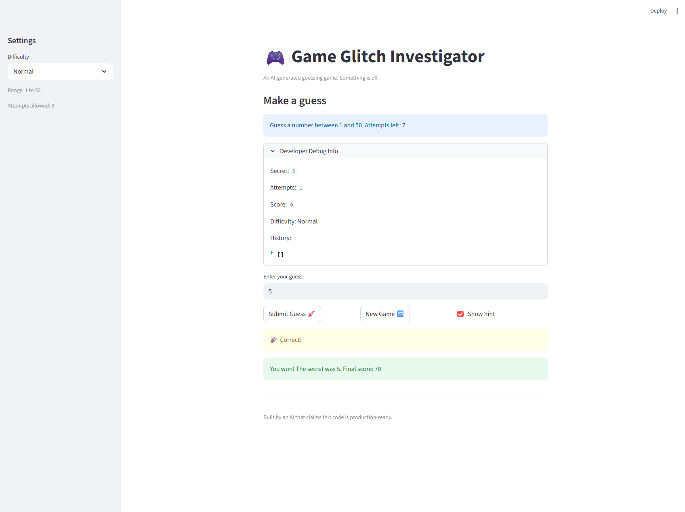

# 🎮 Game Glitch Investigator: The Impossible Guesser

## 🚨 The Situation

You asked an AI to build a simple "Number Guessing Game" using Streamlit.
It wrote the code, ran away, and now the game is unplayable. 

- You can't win.
- The hints lie to you.
- The secret number seems to have commitment issues.

## 🛠️ Setup

1. Install dependencies: `pip install -r requirements.txt`
2. Run the broken app: `python -m streamlit run app.py`

## 🕵️‍♂️ Your Mission

1. **Play the game.** Open the "Developer Debug Info" tab in the app to see the secret number. Try to win.
2. **Find the State Bug.** Why does the secret number change every time you click "Submit"? Ask ChatGPT: *"How do I keep a variable from resetting in Streamlit when I click a button?"*
3. **Fix the Logic.** The hints ("Higher/Lower") are wrong. Fix them.
4. **Refactor & Test.** - Move the logic into `logic_utils.py`.
   - Run `pytest` in your terminal.
   - Keep fixing until all tests pass!

## 📝 Document Your Experience

- [ ] Describe the game's purpose.
      The purpose of this game is to make users guess a secret number within a certain range. The game gives you hintws to help you find the number

- [ ] Detail which bugs you found.
   When I first ran the game I noticed some bugs. First of all hints were backwards, It would tell me to go higher when the secret number is lower and vice versa. Another bug was that the difficulty setting did not work because the secret number always reset from 1 to 100 when starting you start a new game. I also noticed that the displayed range in the game did not match the selected difficulty( to be specific normal and  hard were switched around).

- [ ] Explain what fixes you applied.
   To fix these bugs, (with the help of copilot) I fixed the logic in the check_guess function so the hints were correct. I also updated the difficulty ranges so Easy uses 1–20, Normal uses 1–50, and Hard uses 1–100. I also fixed the new game reset so it generates the secret number using the selected difficulty range instead of always using getting a number from 1 to 100.

## 📸 Demo

- [ ] []

## 🚀 Stretch Features

- [ ] [If you choose to complete Challenge 4, insert a screenshot of your Enhanced Game UI here]
